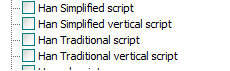
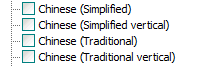

# pyDetectSub
Detect and extract subtitles from video. Emphasis on older movies

https://warped3.substack.com/p/simple-subtitle-extractor-using-opencv

# Steps

When you open test_image_operations.py some error above import code under steps will resolve all errors.

1. `python.exe -m pip install --upgrade pip`

2. `pip install opencv-python`

3.  you should click mouse right button solve problem by auto import ,i use Pycharm Professional that's easy way.

4.  chinese subtitle support,need install windows exe file from https://github.com/UB-Mannheim/tesseract/wiki, 
after install you should add 'D:\Program Files\Tesseract-OCR' to environment Path variables,my install location is d so my tesseract-ocr is above.
when installing tesseract-ocr-w64-setup-xxx.exe Don't forget select chinese support below .

5.  `pip install pytesseract`

6.  test pytesseract whether install success
`print(tess.get_tesseract_version())`
`print(tess.get_languages())`

my console is show below
PyDev console: starting.
Python 3.10.6 (tags/v3.10.6:9c7b4bd, Aug  1 2022, 21:53:49) [MSC v.1932 64 bit (AMD64)] on win32
runfile('D:\\PythonProjects\\pyDetectSub\\test_image_operations_zh.py', wdir='D:\\PythonProjects\\pyDetectSub')
`5.3.1.20230401`
`['chi_sim', 'chi_sim_vert', 'chi_tra', 'chi_tra_vert', 'eng', 'osd']`

